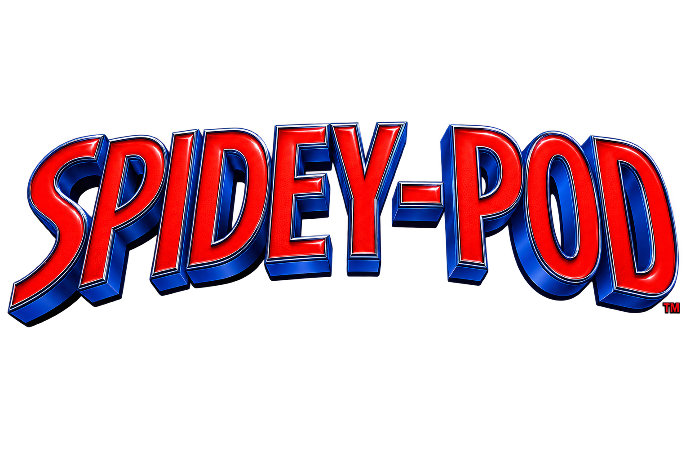
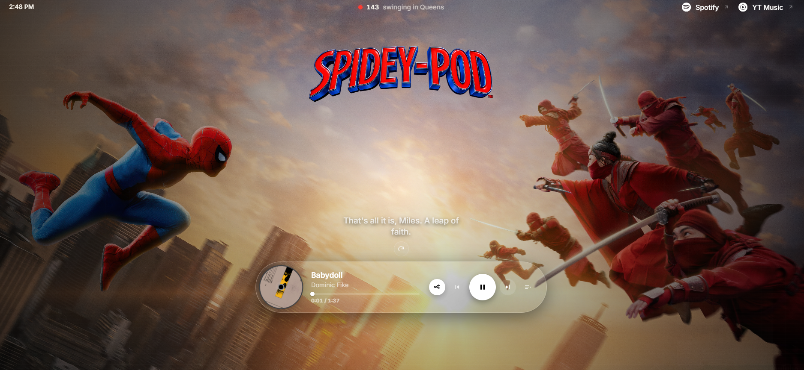
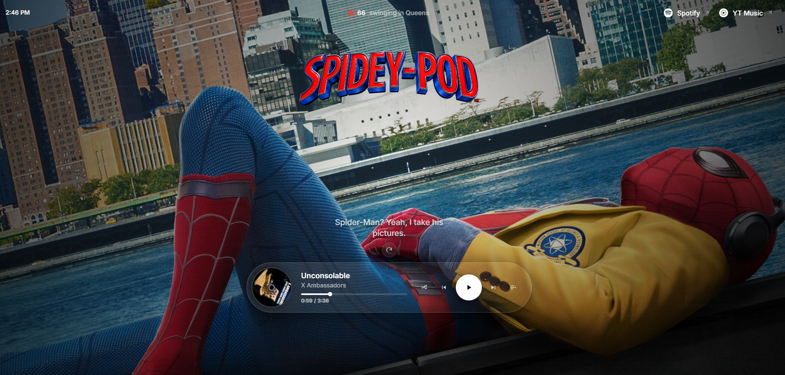
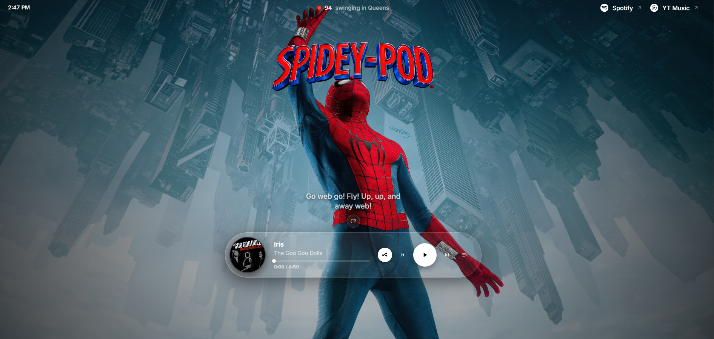
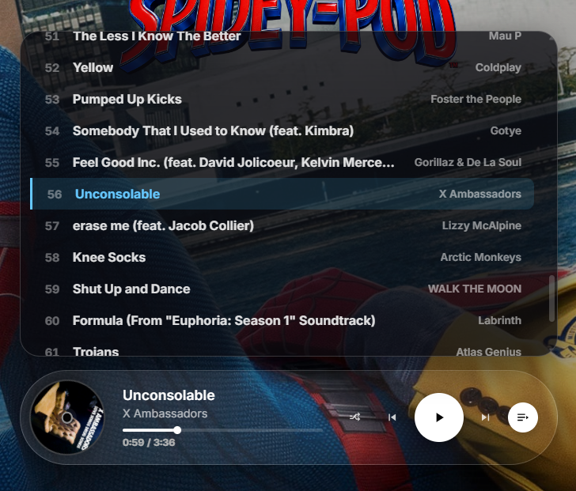
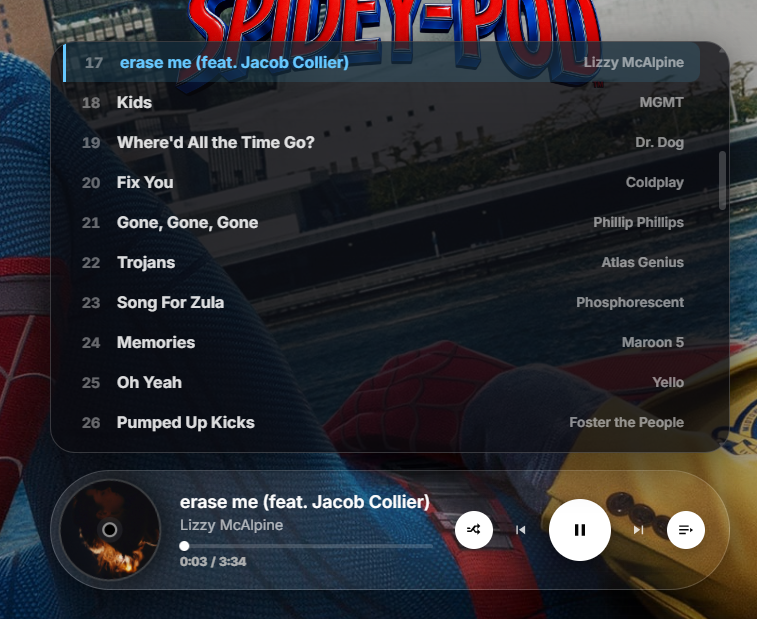
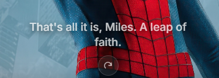
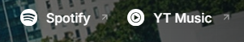

# 🕷️ SpideyPod

SpideyPod is a premium, high-performance web music player platform designed with a Spider-Man theme. It features a modern, cinematic glassmorphic UI, dynamic ambient background cross-fading, an interactive quotes engine, and a seamless responsive audio discovery experience powered by the YouTube Iframe API.



## 📸 Screenshots















## ✨ Features

- **Ambient Background Switcher**: Custom background cross-fade system preloading 17 different high-resolution Spider-Man wallpapers, fading them dynamically with GPU-accelerated CSS transitions on song changes.
- **Compact Mobile Grid Layout**: A mobile-first CSS Grid player layout that rearranges the player vertically on small screens—putting the album disc and track metadata in one row, and centering controls underneath on the lower side of the screen.
- **Sonar Status Indicator**: An industry-standard active presence indicator with a pulsing red radar sonar dot reflecting live local listeners swinging in Queens.
- **Quotes Rotation Engine**: Dynamic quote display that center-aligns quotes, wrapping them cleanly, and loads them dynamically from an external plain text `quote.txt` file with adjustable delay times.
- **Clean Navigation Links**: Flat brand links for Spotify and YouTube Music in the header, fading smoothly to a semi-transparent state on hover without blocky containers.
- **Modern UI Highlights**:
  - Full Glassmorphic controls card with custom **Inter** typography.
  - Custom-styled scrollbars hiding default browser arrow chevrons for an industry-standard clean slider look.
  - Complete custom seek bar with a persistent sliding handle.
- **Dynamic Browser Tabs**: Browser window tabs automatically update their titles to show the currently playing song in the format: `Song - SpideyPod`.

## 🚀 Tech Stack

- **Core**: Vanilla HTML5 & Vanilla ES6+ JavaScript
- **Styling**: Custom Modern CSS3 (CSS Custom Properties, Flexbox, Grid)
- **API Integration**: YouTube Iframe API
- **Fonts**: Google Fonts (Inter)
- **Dev Tooling**: Custom Node.js local development server with LocalTunnel binding

## 🛠️ Installation & Setup

1. **Clone the repository**:
   ```bash
   git clone https://github.com/90tash/SpideyPod.git
   cd SpideyPod
   ```

2. **Install Dependencies**:
   ```bash
   npm install
   ```

3. **Run the Application**:
   ```bash
   npm run dev
   ```
   *The local server runs on port 3000. It includes LocalTunnel bindings to serve files securely over HTTPS, bypassing copyright-restricted VEVO restrictions.*

## 📁 Project Structure

```text
SpideyPod/
├── assets/
│   ├── bg/              # Thematic wallpapers (bg-1 to bg-17)
│   ├── ss/              # Screenshots for README and documentation
│   └── title/           # SpideyPod logo and branding assets
├── app.js               # Core player audio controls, local loops, and fetch scripts
├── styles.css           # Glassmorphic themes, animations, and responsive media queries
├── tracks.json          # Local playlist mapping metadata
├── quote.txt            # Plain-text configurable quotes database (one per line)
├── dev-server.js        # Node.js development server
├── index.html           # Entry point document
└── README.md            # Documentation
```

## 🎨 UI Highlights

### Custom Sonar Indicator
The active status indicator uses a solid pulsing red radar circle expanding underneath the status dot, styled completely in CSS without container blocks.

```css
.presence__dot::after {
  content: "";
  position: absolute;
  inset: 0;
  border-radius: 50%;
  background: rgba(255, 59, 48, 0.6);
  pointer-events: none;
  animation: ping 1.8s cubic-bezier(0.16, 1, 0.3, 1) infinite;
}
```

### Mobile-first Grid Player
To fit compact phone viewports, the horizontal desktop layout folds into a grid, placing the active song artwork and status bar on top and playback controls centered beneath.

```css
@media (max-width: 760px) {
  .player {
    display: grid !important;
    grid-template-columns: auto 1fr !important;
    grid-template-areas:
      "disc meta"
      "controls controls" !important;
    gap: 0.8rem 1rem !important;
  }
}
```

## 📄 License

This project is licensed under the MIT License - see the LICENSE file for details.

## 🤝 Contributing

Contributions are welcome! Please feel free to submit a Pull Request.

Built with ❤️ by [Ashish Patra (90tash)](https://github.com/90tash)
